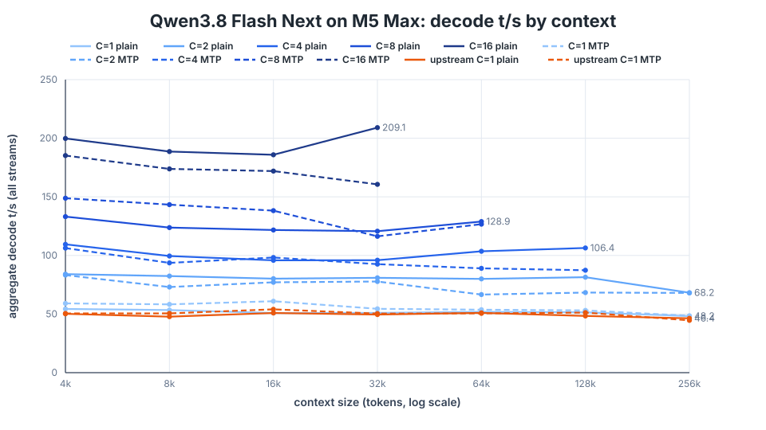
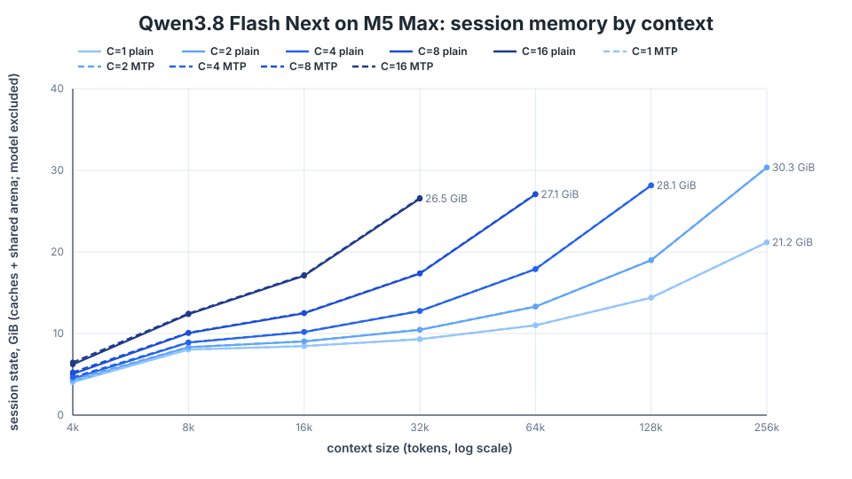

# Qwen3.8 Flash Next on an M5 Max: decode throughput and session memory by context and concurrency

Machine: Apple M5 Max, 128 GB. Model: `ds4flash.gguf` (Qwen3.8-Flash-Next Q4,
69.7 GiB resident). Branch `qwen3.8-flash-next-batched` against upstream `main`
at 9139e2a. Harness: `speed-bench/session_concurrency_bench`, prompts cut from
`speed-bench/promessi_sposi.txt`, 4 warm-up steps then 32 decoded steps per
stream (64 for the MTP series), one run per cell. Cells whose sessions would
not fit the memory budget are skipped by the harness.

Aggregate decode t/s over all streams (C = concurrent streams):

| plain     |   4k |   8k |  16k |  32k |  64k | 128k | 256k |
|-----------|-----:|-----:|-----:|-----:|-----:|-----:|-----:|
| C=1       | 54.3 | 53.4 | 50.9 | 51.0 | 51.9 | 51.5 | 48.2 |
| C=2       | 84.1 | 82.4 | 80.2 | 80.9 | 80.0 | 81.5 | 68.2 |
| C=4       |109.5 | 99.5 | 95.8 | 96.0 |103.5 |106.4 |    — |
| C=8       |133.1 |123.8 |121.7 |120.7 |128.9 |    — |    — |
| C=16      |199.8 |188.6 |185.9 |209.1 |    — |    — |    — |

| batched MTP (64 steps) |   4k |   8k |  16k |  32k |  64k | 128k | 256k |
|------------------------|-----:|-----:|-----:|-----:|-----:|-----:|-----:|
| C=1                    | 59.1 | 58.3 | 61.0 | 54.5 | 53.7 | 53.1 | 48.5 |
| C=2                    | 83.2 | 73.1 | 77.1 | 77.8 | 66.6 | 68.3 | 68.0 |
| C=4                    |106.3 | 93.7 | 98.3 | 92.6 | 89.0 | 87.4 |    — |
| C=8                    |148.8 |143.3 |138.2 |116.3 |126.7 |    — |    — |
| C=16                   |185.2 |173.8 |172.0 |160.7 |    — |    — |    — |

| upstream main, C=1 |   4k |   8k |  16k |  32k |  64k | 128k | 256k |
|--------------------|-----:|-----:|-----:|-----:|-----:|-----:|-----:|
| plain              | 50.2 | 47.8 | 50.9 | 49.6 | 51.0 | 48.4 | 46.4 |
| MTP                | 50.5 | 50.6 | 54.0 | 50.4 | 50.6 | 51.2 | 44.6 |

Session memory is the engine's own accounting (each stream's KV and indexer
caches plus the shared transients arena), the figure that admits sessions;
the resident model is not included. ~32 KB per token per stream; the arena
is 2.7 GiB at a 4k cap and 5.3 GiB at the 8k prefill chunk, once.

Reading it: plain decode flattens with concurrency because every row of a
step reads its own expert bytes (a 32-row step costs 149 ms against 80 for
16 rows). Batched MTP drafts only while its measured acceptance covers the
cycle's cost, after eight warm-up cycles; it gains most at C=8, where the
draft rows fill the 16-row tile the batch already has, and on this prose it
still loses at C=16 (the policy settles to plain). The three series were
measured back to back over three hours; thermal drift under sustained load
moved identical cells by 5 to 15% (C=1 at 128k in MTP: 63.9 then 53.1 t/s an
hour apart), so differences under ~10% between series are not significant.

Regenerate the charts with `python3 speed-bench/plot_ctx_sweep.py
speed-bench/m5_max_ctx_sweep --title "Qwen3.8 Flash Next on M5 Max"`.
